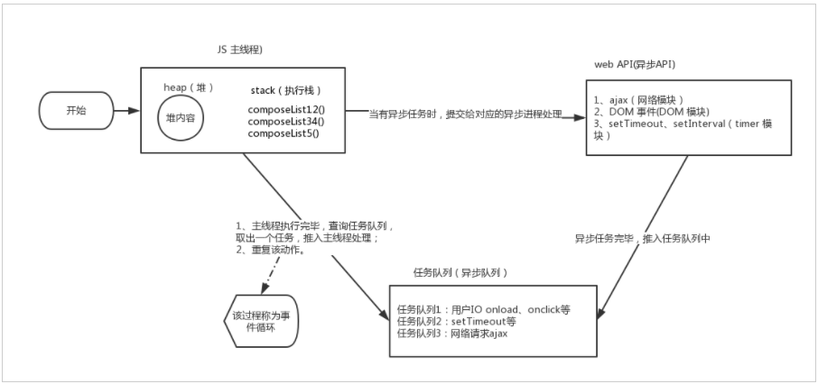

# JavaScript 关于事件循环机制的刨析

[链接地址] (https://www.jb51.net/article/229477.htm)

## 事件循环和任务队列产生的原因：

首先，JS 是单线程,这样设计也是具有合理性的，试想如果一边进行 dom 的删除，另一边又进行 dom 的添加，浏览器该如何处理？

引用：

“单线程即任务是串行的，后一个任务需要等待前一个任务的执行，这就可能出现长时间的等待。但由于类似 ajax 网络请求、setTimeout 时间延迟、DOM 事件的用户交互等，这些任务并不消耗 CPU，是一种空等，资源浪费，因此出现了异步。通过将任务交给相应的异步模块去处理，主线程的效率大大提升，可以并行的去处理其他的操作。当异步处理完成，主线程空闲时，主线程读取相应的 callback，进行后续的操作，最大程度的利用 CPU。此时出现了同步执行和异步执行的概念，同步执行是主线程按照顺序，串行执行任务；异步执行就是 cpu 跳过等待，先处理后续的任务（CPU 与网络模块、timer 等并行进行任务）。由此产生了任务队列与事件循环，来协调主线程与异步模块之间的工作。“”

## 事件循环机制：

首先把 JS 执行代码操作 分为主线程，任务队列，任何一段 js 代码的执行都可以分为以下几个步骤：

步骤一： 主线程读取 JS 代码，此时为同步环境，形成相应的堆和执行栈；
步骤二： 当主线程遇到异步操作的时候，将异步操作交给对应的 API 进行处理；
步骤三： 当异步操作处理完成，推入任务队列中
步骤四： 主线程执行完毕后，查询任务队列，取出一个任务，并推入主线程进行处理
步骤五： 重复步骤二、三、四

其中常见的异步操作有：ajax 请求，setTimeout,还有类似 onclik 事件等
等

## 任务队列：

同步和异步任务分别进入不同的执行环境，同步的进入主线程，即主执行栈，异步的进入任务队列

首先，顾名思义，既然是一个队列，那么就遵循 FIFO 原则

如上示意图，任务队列存在多个，它们的执行顺序：

同一任务队列内，按队列顺序被主线程取走；
不同任务队列之间，存在着优先级，优先级高的优先获取（如用户 I/O）

### 任务队列的类型：

任务队列分为 宏任务(macrotask queue) 和 微任务(microtask queue)

宏任务主要包含：script( 整体代码)、setTimeout、setInterval、I/O、UI 交互事件、setImmediate(Node.js 环境)

微任务主要包含：Promise、MutaionObserver、process.nextTick(Node.js 环境)

### 两者区别：

微任务 microtask queue:

(1) 唯一，整个事件循环当中，仅存在一个;
(2) 执行为同步，同一个事件循环中的 microtask 会按队列顺序，串行执行完毕；

PS：所以利用 microtask queue 可以形成一个同步执行的环境

宏任务 macrotask queue:

(1) 不唯一，存在一定的优先级（用户 I/O 部分优先级更高）
(2) 异步执行，同一事件循环中，只执行一个

### 更细致的事件循环过程

一、二、三、步同上
主线程查询任务队列，执行 microtask queue，将其按序执行，全部执行完毕;
主线程查询任务队列，执行 macrotask queue，取队首任务执行，执行完毕；
重复四、五步骤;

## 强大的异步专家 process.nextTick()

### process.nextTick()在何时调用？

任何时候在给定的阶段中调用 process.nextTick()，所有传递到 process.nextTick() 的回调将在事件循环继续之前解析

在事件循环中，每进行一次循环操作称为 tick，知道了这个之后，对理解这个方法什么时候调用瞬间明白了一些！

process.nextTick 中的回调是在当前 tick 执行完之后，下一个宏任务执行之前调用的。
